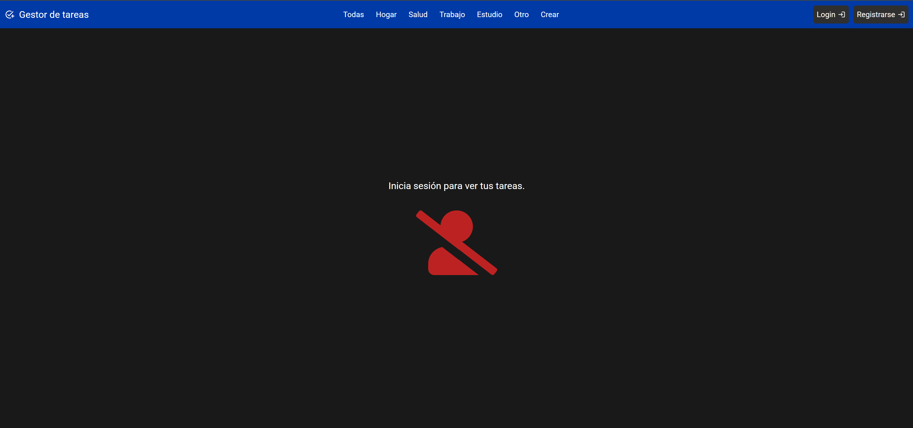
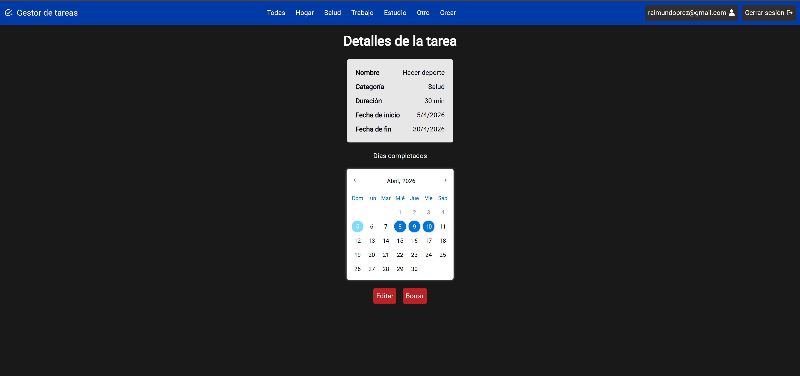

# Gestor de tareas cotidianas
Una aplicación web para la gestión y seguimiento de la realización de tareas cotidianas de personas mayores. Parte front de la aplicación con Vite + React.

## Descripción
Esta es la parte front de la aplicación, donde se ha diseñado una interfaz gráfica que cualquier persona puede utilizar para ver, crear, editar y borrar tareas personales y llevar un seguimiento diario de su realización. Los componentes de una tarea se describen en detalle en la documentación de la parte back.

La aplicación que se ha desarrollado es multiusuario, lo que significa que es necesario realizar un proceso de registro para identificar al usuario actual y que este pueda trabajar únicamente con sus tareas. Si el usuario no está registrado y logueado en la aplicación, esta no puede usarse.

### Funcionalidades disponibles
- Login y registro: El usuario puede registrarse y loguearse en la aplicación mediante correo electrónico y contraseña. Estos procesos se delegan a Firebase, de manera que el usuario nunca comunica sus credenciales de acceso al back, sino solo tokens de acceso generados por Firebase.
- Visualización rápida de tareas por categoría.
- Visualización detallada de tareas al hacer clic en la vista rápida de una tarea.
- Acceso al borrado y edición de tareas desde la vista detallada.
- Calendario interactivo en la vista detallada donde los usuarios pueden marcar y desmarcar los días en los que han completado una tarea con un simple clic.
- Menú de creación de tareas.

## Instalación y ejecución
- Obtener un `.env` válido o crear uno propio partiendo de `.env.example`.
- Instalar todos los paquetes necesarios con el comando: `npm install`.
- Arrancar la aplicación en modo desarrollo con `npm run dev`. Generar ficheros para producción con `npm run build`.

## Tecnologías y paquetes utilizados
- Vite + React: Frameworks de desarrollo.
- Firebase: Plataforma a la que delegamos la identificación de usuarios.
- firebase: Paquete NPM para uso de firebase en cliente.
- react-router-dom: Para navegar por la página sin recargar (SPA).
- reactjs-popup: Paquete que permite crear paneles emergentes rápidamente. Se ha utilizado para notificar errores al usuario y para las ventanas de login y registro.
- react-icons: Paquete con multitud de iconos útiles que se han utilizado en la aplicación.
- react-multi-date-picker + react-date-object: Paquetes usados para crear el calendario interactivo de cada tarea.

## Versión de prueba
En el siguiente enlace se proporciona una versión de prueba del frontend.
- LINK_PROYECTO
